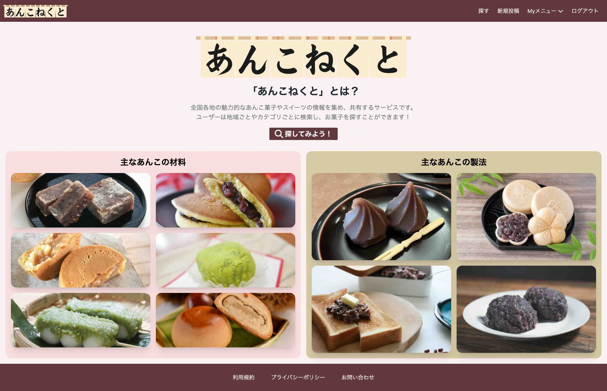
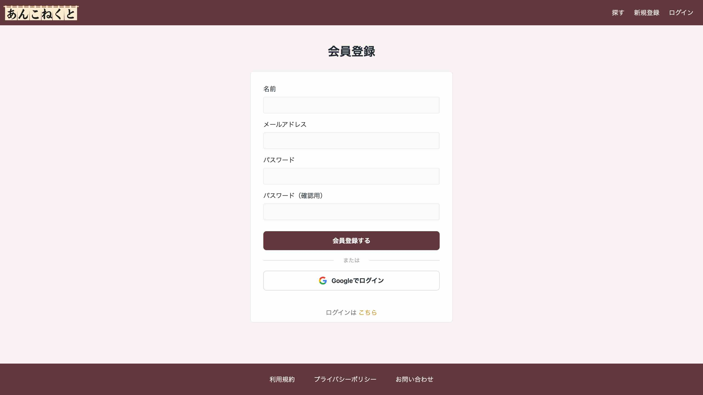
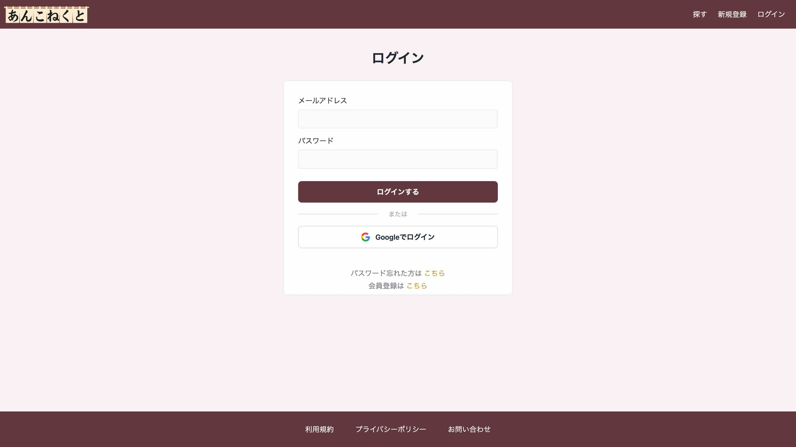
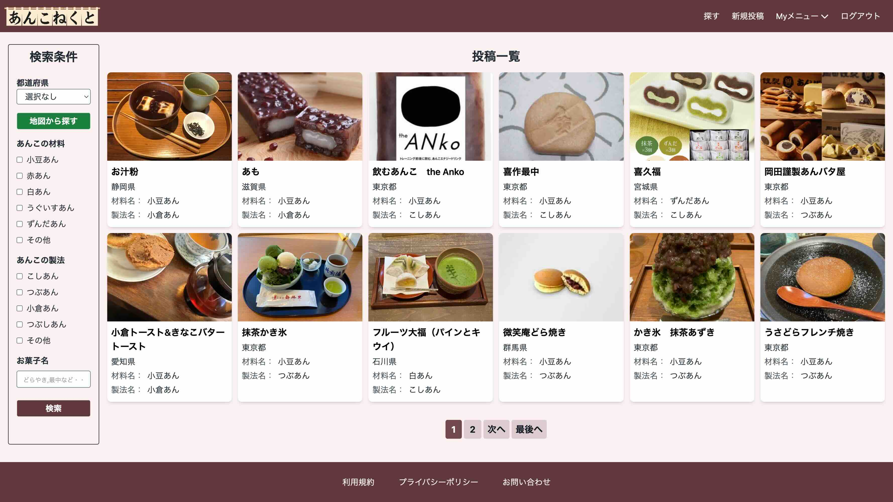
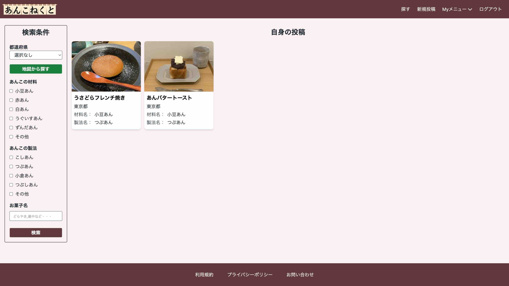
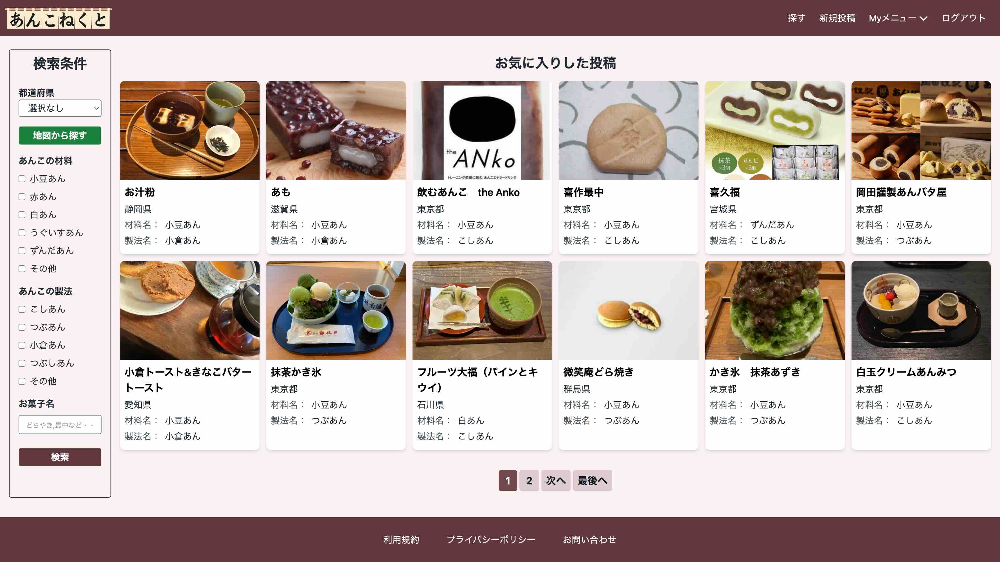
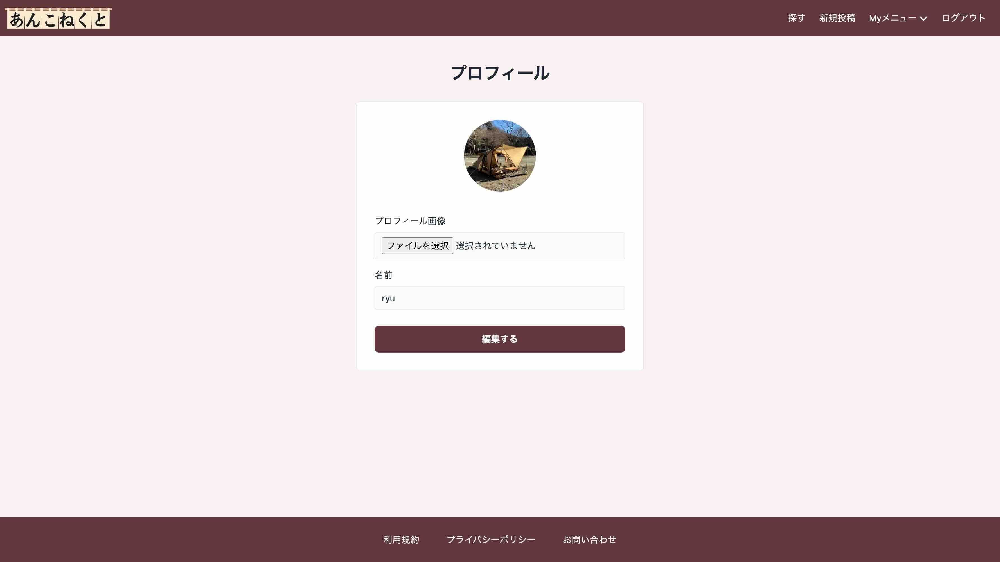
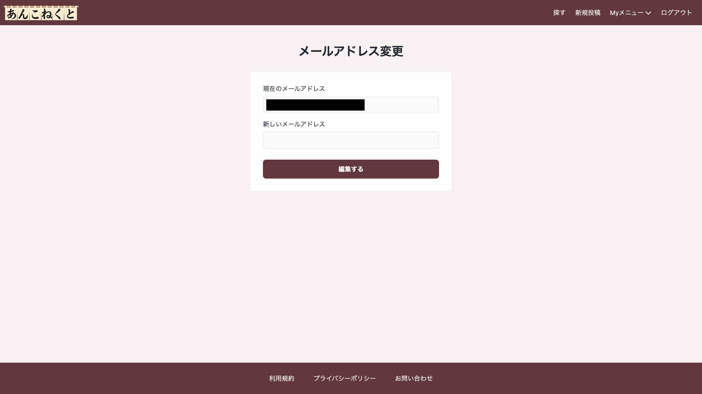
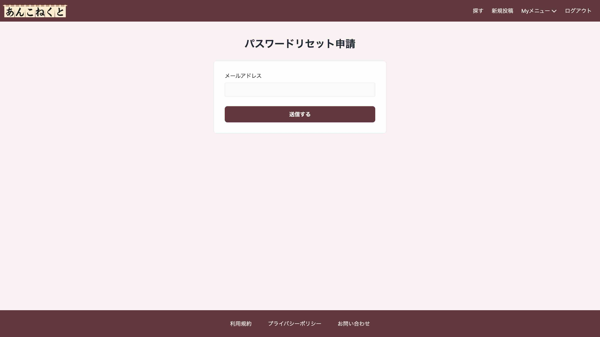

# あんこと人が繋がる場『あんこねくと』

 

## サービスのURL
https://an-connect.com/

 

## サービス概要
このサービスは、全国のあんこ菓子やスイーツの情報を共有・発信するプラットフォームです。 
サービスを通じて、全国各地の魅力的なあんこ菓子やスイーツを発見し、あんこ文化に触れ合える場を提供しています。

 

## このサービスへの思い・作りたい理由
私の祖父母が住んでいるのは和菓子文化が深く根付いている石川県です。 
長期休暇の度に訪れ、その場所の伝統的な和菓子を食べるが楽しみでした。 

幼いころから和菓子を食べてきた私は、季節ごとの異なる風味や素材、そしてその美しさに引きつけられてきました。 
特に、羊羹や最中、きんつば、どら焼きなどの「あんこ」を使用したお菓子には、その甘さと滑らかな食感、そしてさまざまな素材から作られる餡が魅力的でした。

そのような経験から、
- 「あんこ」の美味しさを広く伝えたい
- 多くの人に「あんこ」の魅力を感じてもらいたい
- 未知の「あんこ」の魅力を探求したい

という思いが生まれ、私はこのあんこをテーマにした交流の場『あんこねくと』というサービスを立ち上げました。 

この『あんこねくと』を通じて、あんこの深い魅力をより多くの人々に広め、その美味しさが少しでも伝わればいいなと思っています。 
ぜひこのサービスをご利用いただき、あんこの世界を深く味わってください。

 

## ユーザー層について
- あんこが好きな人
- 手土産選びに迷っている人
- あんこを提供するお店を探している人
- 自身のおすすめあんこ菓子を共有したい人

 

## サービスの利用イメージ
全国のあんこ菓子の情報を共有するプラットフォームです。地域やカテゴリごとに検索し、新しいお菓子を発見できます。
ユーザー同士でお気に入りのあんこ菓子を共有したり、他の人のおすすめを探ることもできます。

 

## ユーザーの獲得について
- 知人などに紹介して触ってもらう
- Xでシェアされた投稿でユーザーを獲得する

 

## サービスの差別化ポイント・推しポイント
### 全国の「あんこ」の情報共有
　全国各地の魅力的なあんこ菓子やスイーツの情報を集め、共有することができます。 
　ユーザーは地域ごとやカテゴリごとに検索し、新しいお菓子を発見することができます。
### ユーザー間の交流
　ユーザーは写真やコメントを投稿し、自分のお気に入りのあんこ菓子を共有したり、他の人のおすすめを探ることができます。

 

## 機能一覧
| トップ画面(ログイン前) |　トップ画面(ログイン後) |
| ---- | ---- |
|  | .jpg) |
| サービスの説明とあんこの材料・種類のイメージ写真と説明を掲載。 | サービスの説明とあんこの材料・種類のイメージ写真と説明を掲載。 |

| 新規登録画面 |　ログイン画面 |
| ---- | ---- |
|  |  |
| メールアドレスとパスワード、Googleアカウントでの会員登録を実装しました。 | メールアドレスとパスワード、Googleアカウントでの認証機能を実装しました。 |

| 投稿一覧画面 |　投稿一覧(マップ)画面 |
| ---- | ---- |
|  | .jpg) |
| 投稿一覧表示機能を実装しました。都道府県、あんこの材料・製法、キーワードで絞り込み検索が可能。 | Maps JavaScript APIを使用して投稿をマップに表示しました。 |

| 投稿一覧(マップ)画面 |　新規投稿画面 |
| ---- | ---- |
| .jpg) |  |
| 吹き出しで投稿が表示されるように実装しました。 | Google Places APIを用いたオートコンプリート機能を実装しました。 |

| 投稿詳細画面 |　投稿編集画面 |
| ---- | ---- |
| .jpg) | .jpg) |
| 投稿の詳細画面を実装しました。。 | 投稿の編集画面を実装しました。 |

| 投稿(自身)一覧画面 |　お気に入り投稿一覧画面 |
| ---- | ---- |
|  |  |
| 自身の投稿一覧表示機能を実装しました。 | お気に入りした投稿の一覧表示を実装しました。 |

| プロフィール画面 |　メールアドレス変更画面 |
| ---- | ---- |
|  |  |
| プロフィール画像とユーザーネームの編集機能を実装しました。 | メールアドレスの変更機能を実装しました。 |

| パスワード変更画面 |　 |
| ---- | ---- |
|  |  |
| パスワードの変更機能を実装しました。 |  |

 

## **実装機能について**
- トップページ
- 会員登録・ログイン
  - ゲスト：検索
  - 会員：検索・新規投稿・お気に入り
- 新規投稿
  - お菓子名
  - 写真
  - 都道府県（選択）
  - 店名
  - 住所（任意・Google Maps APIを用いてGoogleマップ上にマーカーを表示させる）
  - 種類（選択）
    - 材料（小倉あん・赤あん・白あん・うぐいすあん・ずんだあん・その他）
    - 製法（こしあん・つぶあん・小倉あん・つぶしあん）
  - コメント
- 検索
  - mapからの検索（Googleマップ上のマーカー）
  - 都道府県・種類での絞り込み
- 投稿一覧
- 投稿詳細
- お気に入り
- 利用規約
- お問い合わせ
- プライバシーポリシー
- SNS(X)シェア
- Googleログイン

## 使用技術

| カテゴリー          | 使用技術                                              |
| ----------------- | --------------------------------------------------   |
| フロントエンド      | HTML, JavaScript, TailwindCSS       　　　            |
| バックエンド        | Ruby, Ruby on Rails         　　　　                  |
| インフラ           | Fly.io, AWS S3                                       |
| データベース        | PostgreSQL                                           |
| 開発環境　　        | Docker                                               |
| CI/CD             | GitHub Actions                                       |
| バージョン管理      | GitHub　　　　　                                       |
| API               | Google Maps API                                      |

 

## 画面遷移図
[画面遷移図](https://www.figma.com/file/QtPiLQ1xJznPdVkiXgZuZJ/%E7%84%A1%E9%A1%8C?type=design&node-id=0-1&mode=design&t=yd9ESohdf4IH4Dph-0)

## ER図
